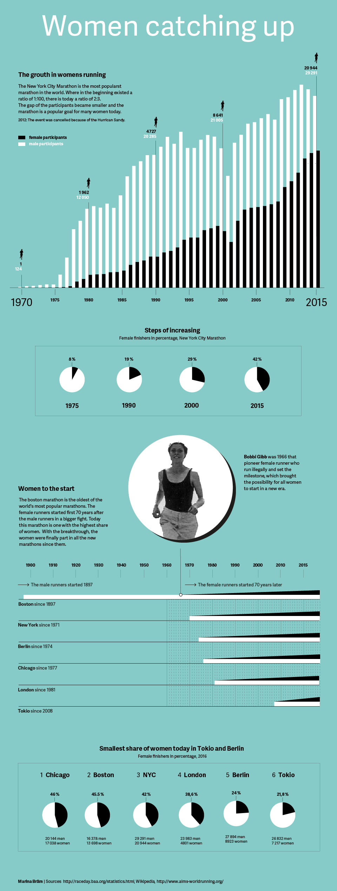

---

title: Women Catching Up
layout: project

---

Nowadays, it’s hard to imagine that women were not allowed to participate in marathon events as recently as 50 years ago. Only due to the tenacity of the female marathon pioneers it was possible to tear down the wall. The data research and the visualization show the increase in female participants at New York City Marathon, the most popular marathon in the world. The increase is linked to the historical issue of women in marathon and collected to the current status of female participants at today’s most important six marathons in the world. Women are catching up – yes. In different ways

